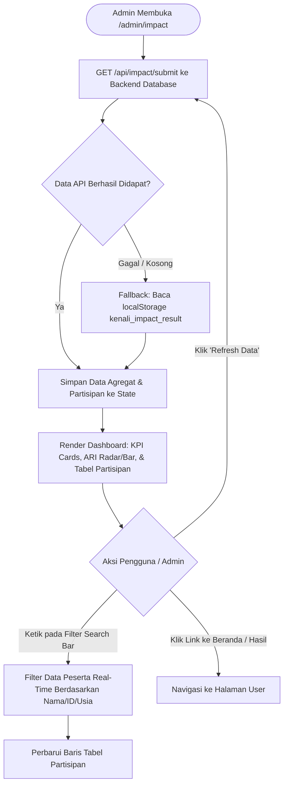

# Flow Dokumentasi: Dashboard Admin & Analisis Behavioral (`/admin/impact`)

Dokumentasi alur dan logika untuk halaman **Dashboard Admin & Analisis Dampak Behavioral (Intervention Analytics)** pada aplikasi **Kenali Modus**. Halaman ini berfungsi sebagai pusat monitoring institusi perbankan untuk memantau efektivitas edukasi, metrik eksperimen (Pre-Test vs Post-Test), pengukuran kognitif ARI (*Attention, Repetition, Intention*), serta proyeksi penghematan finansial nasabah secara agregat.

---

## 1. Ikhtisar Alur Halaman (Page Overview)

1. **Inisialisasi & Pengambilan Data**:
   - Menjalankan request `GET /api/impact/submit` ke Neon PostgreSQL database.
   - Mengambil data ringkasan agregat (`stats`) dan daftar peserta terbaru (`recentParticipants`).
   - *Fallback Mechanism*: Jika API/DB kosong atau offline, sistem membaca data lokal dari `localStorage` (`kenali_impact_result`).
2. **Kartu Metrik Kunci (Executive KPI Overview)**:
   - **Total Partisipan**: Jumlah nasabah yang menyelesaikan eksperimen.
   - **Rata-rata Usia**: Profil demografi peserta.
   - **Baseline Risky Action Rate (Pre-Test)**: Persentase nasabah yang terjebak scam sebelum intervensi.
   - **Post-Test Risky Action Rate**: Persentase kesalahan setelah diberikan 3 Golden Rules BCA.
   - **Behavioral Impact & Relative Reduction**: Tingkat penurunan risiko perilaku secara persentase.
   - **Total Potential Loss Avoided**: Akumulasi potensi kerugian dana nasabah yang berhasil dicegah (skala benchmark OJK).
3. **Analisis Efektivitas Kognitif ARI Survey (Likert Scale 1-10)**:
   - **Attention**: Rata-rata skor fokus peserta terhadap tanda bahaya.
   - **Repetition**: Rata-rata keinginan peserta untuk mengulang simulasi.
   - **Intention**: Rata-rata komitmen menerapkan prinsip keamanan perbankan.
   - **ARI Average Composite**: Rata-rata komposit ketiga dimensi.
4. **Tabel & Filter Data Partisipan**:
   - Menampilkan tabel rincian peserta: *Session ID*, *Nama*, *Usia*, *Skor Pre-Test*, *Skor Post-Test*, *Behavioral Impact*, *Skor ARI*, dan *Waktu Submit*.
   - Filter pencarian instan (*real-time query*) berdasarkan nama, ID sesi, atau usia.
5. **Tombol Ekspor / Refresh**:
   - Fitur reload data real-time dari database.

---

## 2. Diagram Alur (Flowchart)

---

## 3. Komponen & State Management

| State / Variabel | Tipe | Deskripsi |
| :--- | :--- | :--- |
| `data.stats` | `Object` | Objek agregat metrik (avg Pre/Post risky rate, avg ARI, total loss avoided, dll.). |
| `data.recentParticipants` | `Array<Object>` | Daftar record sesi peserta dari Neon PostgreSQL. |
| `loading` | `Boolean` | Loading indicator saat pengambilan data. |
| `filterQuery` | `String` | Query pencarian teks untuk memfilter baris tabel peserta. |

---

## 4. Input & Output

- **Input**: Query pencarian data peserta, trigger refresh data.
- **Output**: Visualisasi ringkasan KPI institusional, skor ARI kognitif, tabel detail log simulasi nasabah.
