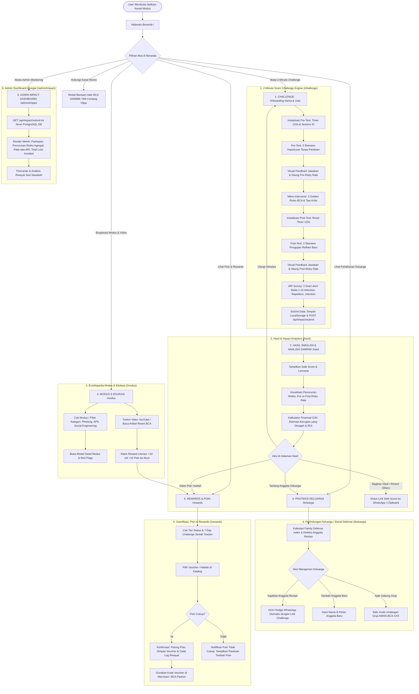
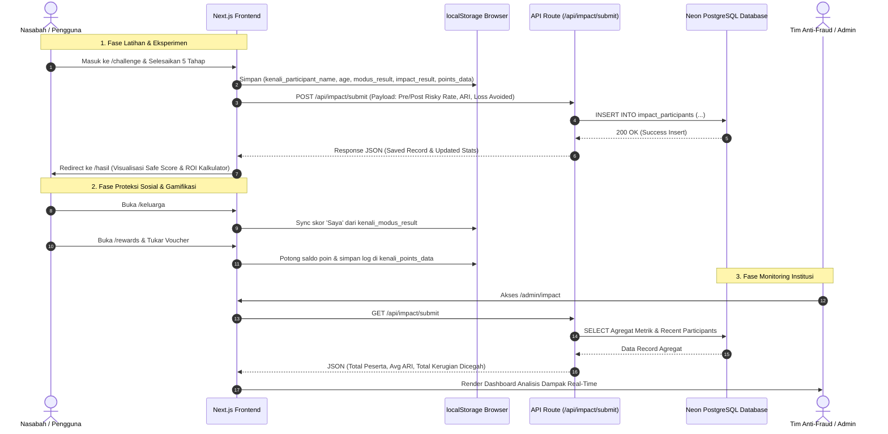

# Dokumentasi Alur Keseluruhan Aplikasi (End-to-End System Flow) — Kenali Modus

Dokumentasi ini merangkum **seluruh arsitektur alur (*end-to-end user journey*)**, keterhubungan antar halaman, siklus intervensi kognitif (*Core Habit Loop*), alur data (*data pipeline & storage*), serta diagram alur lengkap (*comprehensive flowchart*) untuk aplikasi **Kenali Modus**.

---

## 1. Arsitektur & Siklus Utama (Core Architecture & Loops)

Aplikasi Kenali Modus dirancang berdasarkan kerangka kerja intervensi behavioral anti-fraud dengan 4 pilar utama:

```
[1. SIMULASI & REFLEKS]  --->  [2. SAFE SCORE & ROI]  --->  [3. EDUKASI & REWARD]  --->  [4. PROTEKSI SOSIAL]
  (/challenge: 5-Stage)          (/hasil: OJK Model)          (/modus & /rewards)          (/keluarga)
```

1. **Discovery & Onboarding (Beranda `/`)**:
   - Pengguna disambut nilai proposisi utama dan ringkasan skor kewaspadaan.
   - Pintu masuk ke simulasi cepat 2 menit atau ensiklopedia modus terbaru.
2. **Behavioral Experiment Engine (`/challenge`)**:
   - Sistem eksperimen 5 tahap (*Pre-Test $\rightarrow$ 3 Golden Rules Intervention $\rightarrow$ Post-Test $\rightarrow$ ARI Survey $\rightarrow$ DB Sync*).
3. **Analytics & Impact Feedback (`/hasil`)**:
   - Umpan balik skor personal (*Safe Score*), analisis penurunan risiko (*Relative Reduction*), dan kalkulator ROI mitigasi kerugian finansial (benchmark OJK).
4. **Continuous Learning & Incentives (`/modus` & `/rewards`)**:
   - Eksplorasi modus penipuan baru, menonton video/artikel resmi BCA dengan insentif poin literasi, *streak tracker*, dan penukaran reward/voucher.
5. **Collective Defense (`/keluarga`)**:
   - Memantau indeks pertahanan keluarga (*Family Defense Index*), mengidentifikasi anggota rentan, dan mengirim pengingat (*Nudge*) via WhatsApp.
6. **Institutional Governance (`/admin/impact`)**:
   - Dashboard monitoring bagi institusi/perbankan untuk melihat dampak intervensi secara agregat nasional.

---

## 2. Diagram Alur Keseluruhan (Master End-to-End Flowchart)



---

## 3. Peta Navigasi Antar Halaman (Site Navigation Matrix)

| Dari Halaman | Menuju Halaman | Trigger / Aksi Pengguna | Keterangan Data yang Diteruskan / Disinkronkan |
| :--- | :--- | :--- | :--- |
| **Beranda (`/`)** | `/challenge` | Tombol *"Mulai 2-Minute Challenge"* | Membuka onboarding nama & usia, membuat sesi baru. |
| **Beranda (`/`)** | `/modus` | Tombol *"Lihat Semua Modus"* | Membuka katalog modus & video edukasi. |
| **Beranda (`/`)** | Kontak Resmi | Klik Card HaloBCA / WA BCA | Membuka popup kanal resmi pencegahan fraud. |
| **`/challenge`** | `/hasil` | Selesai menjawab 5 tahap (ARI Survey) | Menyimpan skor & hasil eksperimen ke storage dan database. |
| **`/hasil`** | `/keluarga` | Tombol *"Lindungi Keluarga"* | Membawa data Safe Score terbaru untuk diupdate ke profil *"Saya"*. |
| **`/hasil`** | `/rewards` | Tombol *"Klaim Hadiah"* | Mengakses saldo poin hasil menyelesaikan challenge (+10 s/d +20 poin). |
| **`/modus`** | `/challenge` | Tombol *"Coba Skenario Ini"* pada modal detail | Memulai simulasi yang difokuskan pada tipe modus yang dipilih. |
| **`/modus`** | `/rewards` | Menonton video / Membaca artikel edukasi | Menambah poin (+15 / +10 poin) ke `kenali_points_data`. |
| **`/keluarga`** | WhatsApp | Tombol *"Nudge"* pada anggota rentan | Mengirim format teks ajakan latihan via tautan WhatsApp. |
| **`/rewards`** | `/challenge` / `/modus` | Klik *"Misi Peroleh Poin"* | Mengarahkan pengguna untuk latihan/belajar agar saldo poin bertambah. |
| **Navbar/Footer** | Halaman Manapun | Klik ikon navigasi bawah (*Bottom Nav*) | Akses instan ke 5 halaman utama aplikasi. |

---

## 4. Alur Integrasi Data & State Pipeline (Data Flow Architecture)



---

## 5. Ringkasan Kunci Struktur File Dokumentasi Terkait

Untuk detail spesifik per halaman dengan penjelasan komponen, parameter, dan state internal, silakan rujuk ke dokumentasi individual:
- 🏠 **[home-flow.md](file:///d:/kenalimodus/home-flow.md)** — Alur Halaman Beranda.
- ⏱️ **[challenge-flow.md](file:///d:/kenalimodus/challenge-flow.md)** — Alur FSM 5-Tahap 2-Minute Scam Challenge.
- 📊 **[hasil-flow.md](file:///d:/kenalimodus/hasil-flow.md)** — Alur Hasil Simulasi, Efektivitas Intervensi & Kalkulator OJK.
- 📚 **[modus-flow.md](file:///d:/kenalimodus/modus-flow.md)** — Alur Ensiklopedia Modus, Video & Artikel Edukasi Berhadiah.
- 👨‍👩‍👧‍👦 **[keluarga-flow.md](file:///d:/kenalimodus/keluarga-flow.md)** — Alur Family Defense Group, Nudge WhatsApp & Indeks Pertahanan.
- 🎁 **[rewards-flow.md](file:///d:/kenalimodus/rewards-flow.md)** — Alur Daily Streak, Katalog Penukaran Hadiah & Level Tier.
- 🛡️ **[admin-impact-flow.md](file:///d:/kenalimodus/admin-impact-flow.md)** — Alur Monitoring Dashboard Admin & Evaluasi Kognitif ARI.
