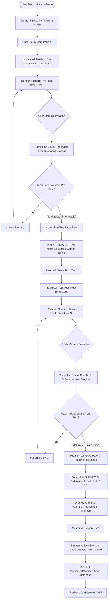

# Flow Dokumentasi: 2-Minute Scam Challenge (`/challenge`)

Dokumentasi alur dan logika untuk halaman **Simulasi 2-Minute Scam Challenge** pada aplikasi **Kenali Modus**. Halaman ini mengimplementasikan eksperimen behavioral intervensi 5 tahap (*Pre-Test*, *Mikro-Intervensi*, *Post-Test*, *ARI Survey*, dan pengiriman data dampak ke database).

---

## 1. Ikhtisar Alur Halaman (Stage Breakdown)

Halaman challenge bekerja dengan sistem Finite State Machine (FSM) multi-tahap:

1. **Tahap 1: `intro` (Onboarding & Identitas)**
   - Pengguna memasukkan Nama dan Usia (tersimpan di `localStorage`).
   - Sistem membuat `sessionId` unik (`km_<timestamp>_<random>`).
   - Menjelaskan aturan simulasi (2 menit, skenario interaktif berbasis kasus nyata).
   - Tombol: **Mulai Simulasi**.

2. **Tahap 2: `pre_test` (Uji Refleks Awal - Baseline)**
   - Timer 120 detik aktif berjalan mundur.
   - Menampilkan 3 skenario acak/terpilih (APK Kurir, Undangan Pernikahan, CS Palsu, dsb.).
   - Pengguna memilih tindakan (misal: "Download file", "Abaikan & Blokir", "Verifikasi kontak").
   - Menampilkan feedback instan (Benar/Salah + Penjelasan).
   - Menyimpan `preAnswers` dan menghitung *Pre-Test Risky Action Rate*.
   - Transisi ke tahap `intervention` setelah semua soal terjawab atau timer habis.

3. **Tahap 3: `intervention` (Edukasi Mikro / 3 Golden Rules BCA)**
   - Timer dijeda/di-reset.
   - Memberikan 3 pedoman krusial:
     1. **JANGAN PERNAH** membagikan OTP / PIN / Password ke siapapun.
     2. **WASPADAI** file APK berkedok foto/undangan/surat tilang.
     3. **VERIFIKASI** ke kanal resmi Halo BCA 1500888 atau WhatsApp resmi bercentang hijau.
   - Tombol: **Lanjut ke Uji Refleks Akhir (Post-Test)**.

4. **Tahap 4: `post_test` (Uji Refleks Akhir)**
   - Timer 120 detik aktif kembali.
   - Menampilkan 3 skenario baru dengan tingkat manipulasi psikologis serupa untuk menguji retensi intervensi.
   - Pengguna memilih jawaban $\rightarrow$ Feedback instan $\rightarrow$ Menyimpan `postAnswers`.
   - Menghitung *Post-Test Risky Action Rate*, *Behavioral Impact*, dan *Relative Risk Reduction*.

5. **Tahap 5: `ari_survey` (Attention, Repetition, Intention Likert Survey)**
   - Mengukur 3 dimensi efektivitas intervensi kognitif (Skala Likert 1-10):
     - **Attention**: Tingkat fokus terhadap tanda-tanda bahaya (*red flags*).
     - **Repetition**: Keinginan mengulang latihan berkala.
     - **Intention**: Niat menerapkan prinsip keamanan pada aktivitas perbankan nyata.
   - Setelah menjawab 3 pertanyaan, data dikompilasi.

6. **Tahap 6: Submission & Penyimpanan Hasil**
   - Menghitung Safe Score akhir, agregat poin rewards (+10 poin challenge, bonus perfect score).
   - Menyimpan hasil ke `localStorage` (`kenali_modus_result`, `kenali_impact_result`, `kenali_points_data`).
   - Melakukan POST request asinkron ke endpoint `/api/impact/submit` (Neon Postgres DB).
   - Mengarahkan pengguna secara otomatis ke halaman `/hasil`.

---

## 2. Diagram Alur (Flowchart)

---

## 3. Komponen & State Management

| State / Variabel | Tipe | Deskripsi |
| :--- | :--- | :--- |
| `stage` | `String` | `'intro'` \| `'pre_test'` \| `'intervention'` \| `'post_test'` \| `'ari_survey'` |
| `participantName` | `String` | Nama peserta yang dimasukkan di intro. |
| `participantAge` | `Number` | Usia peserta untuk segmentasi analitik data. |
| `sessionId` | `String` | Identifier unik per sesi simulasi. |
| `timeLeft` | `Number` | Countdown timer (detik) per fase pengujian. |
| `preAnswers` | `Array` | Rekam jejak respon skenario tahap Pre-Test. |
| `postAnswers` | `Array` | Rekam jejak respon skenario tahap Post-Test. |
| `ariAnswers` | `Object` | Nilai survei `{ ari_attention, ari_repetition, ari_intention }`. |
| `isSubmitting` | `Boolean` | Loading state saat mengirim payload ke API. |

---

## 4. Formula Perhitungan Kunci

- **Risky Action Rate**:
  $$\text{Risky Rate (\%)} = \left( \frac{\text{Jumlah Jawaban Berisiko/Salah}}{\text{Total Pertanyaan}} \right) \times 100$$
- **Behavioral Impact (Penurunan Risiko Absolut)**:
  $$\text{Behavioral Impact} = \text{Pre-Test Risky Rate} - \text{Post-Test Risky Rate}$$
- **Relative Reduction**:
  $$\text{Relative Reduction (\%)} = \left( \frac{\text{Pre Risky Rate} - \text{Post Risky Rate}}{\text{Pre Risky Rate}} \right) \times 100$$
- **Potential Loss Avoided (Estimasi Benchmark OJK)**:
  $$\text{Estimasi Penyelamatan} = \text{Jumlah Laporan (1000)} \times \text{Relative Reduction} \times \text{Rp 21.894.880}$$
