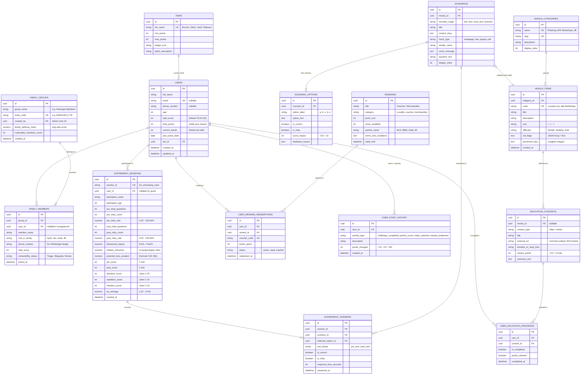

# Entity Relationship Diagram (ERD) & Database Schema Design — Kenali Modus

Dokumen ini merancang arsitektur basis data, entitas (*entities*), atribut (*attributes*), serta hubungan relasional (*relationships & cardinalities*) untuk implementasi sistem penuh **Kenali Modus**. Rancangan ini mencakup modul eksperimen kognitif (Pre/Post Test & ARI Survey), manajemen pengguna/keluarga (*Family Social Defense*), katalog ensiklopedia modus, gamifikasi & poin reward, serta saluran kontak darurat.

---

## 1. Visual ERD (Mermaid Diagram)



---

## 2. Kamus Data & Spesifikasi Entitas (Data Dictionary)

### 2.1. Domain Pengguna & Proteksi Sosial (User & Family Domain)

#### 1. `USERS`
Menyimpan data identitas, skor keamanan (*Safe Score*), akumulasi poin reward, dan tingkatan lencana pengguna.
- `id` (UUID, Primary Key)
- `full_name` (VARCHAR(100), NOT NULL) — Nama lengkap/panggilan responden atau nasabah.
- `email` (VARCHAR(150), UNIQUE, Nullable) — Email untuk sinkronisasi akun.
- `phone_number` (VARCHAR(20), Nullable) — Nomor HP untuk notifikasi WhatsApp.
- `age` (INT, Default: 25) — Usia untuk segmentasi analitik kerentanan.
- `safe_score` (INT, Default: 78, Range: 0-100) — Skor refleks keamanan terkini.
- `total_points` (INT, Default: 0) — Saldo poin rewards aktif.
- `current_streak` (INT, Default: 1) — Jumlah hari berturut-turut berlatih.
- `tier_id` (UUID, Foreign Key $\rightarrow$ `TIERS.id`) — Level loyalitas/edukasi pengguna.
- `created_at` & `updated_at` (TIMESTAMP WITH TIME ZONE)

#### 2. `FAMILY_GROUPS`
Menyimpan data grup perlindungan keluarga (*Collective Social Defense*).
- `id` (UUID, Primary Key)
- `group_name` (VARCHAR(100), NOT NULL) — Contoh: *"Keluarga Bahagia"*.
- `invite_code` (VARCHAR(20), UNIQUE, NOT NULL) — Contoh: `AMAN-BCA-778`.
- `created_by` (UUID, Foreign Key $\rightarrow$ `USERS.id`) — Pemilik/Admin grup.
- `family_defense_index` (NUMERIC(5,2)) — Rata-rata Safe Score seluruh anggota grup.
- `vulnerable_members_count` (INT) — Jumlah anggota dengan skor di bawah 65.
- `created_at` (TIMESTAMP WITH TIME ZONE)

#### 3. `FAMILY_MEMBERS`
Relasi anggota dalam grup keluarga, baik yang sudah mendaftar maupun yang diinput manual oleh admin keluarga.
- `id` (UUID, Primary Key)
- `group_id` (UUID, Foreign Key $\rightarrow$ `FAMILY_GROUPS.id`, ON DELETE CASCADE)
- `user_id` (UUID, Foreign Key $\rightarrow$ `USERS.id`, Nullable) — Terhubung jika anggota sudah mendaftar.
- `member_name` (VARCHAR(100), NOT NULL) — Contoh: *"Ayah"*, *"Ibu"*, *"Kakek"*.
- `role_in_family` (VARCHAR(50)) — Contoh: *"Orang Tua"*, *"Anak"*, *"Lansia"*.
- `phone_number` (VARCHAR(20)) — Nomor untuk pengiriman *Nudge* WhatsApp otomatis.
- `safe_score` (INT, Default: 50) — Skor keamanan individual anggota.
- `vulnerability_status` (VARCHAR(30)) — `'Tinggi'`, `'Waspada Sedang'`, `'Rentan'`.
- `joined_at` (TIMESTAMP WITH TIME ZONE)

---

### 2.2. Domain Eksperimen & Intervensi Kognitif (Behavioral Experiment Domain)

#### 4. `EXPERIMENT_SESSIONS`
Menyimpan satu sesi lengkap simulasi *2-Minute Scam Challenge* (Pre-Test, Intervensi, Post-Test, ARI Survey).
- `id` (UUID, Primary Key)
- `session_id` (VARCHAR(100), UNIQUE, NOT NULL) — Contoh: `km_1726578000_a1b2`.
- `user_id` (UUID, Foreign Key $\rightarrow$ `USERS.id`, Nullable untuk sesi tanpa login)
- `participant_name` (VARCHAR(100), Default: `'Responden'`)
- `participant_age` (INT, Default: 25)
- `pre_total_questions` (INT, Default: 3 / 5)
- `pre_risky_count` (INT, NOT NULL) — Jumlah keputusan berisiko sebelum intervensi.
- `pre_risky_rate` (NUMERIC(5,2), NOT NULL) — $\left(\frac{\text{pre\_risky\_count}}{\text{pre\_total}}\right) \times 100$.
- `post_total_questions` (INT, Default: 3 / 5)
- `post_risky_count` (INT, NOT NULL) — Jumlah keputusan berisiko sesudah intervensi.
- `post_risky_rate` (NUMERIC(5,2), NOT NULL) — $\left(\frac{\text{post\_risky\_count}}{\text{post\_total}}\right) \times 100$.
- `behavioral_impact` (NUMERIC(5,2), NOT NULL) — $\text{Pre Risky Rate} - \text{Post Risky Rate}$.
- `relative_reduction` (NUMERIC(5,2), NOT NULL) — $\left(\frac{\text{Pre} - \text{Post}}{\text{Pre}}\right) \times 100$.
- `potential_loss_avoided` (NUMERIC(15,2), NOT NULL) — Estimasi dana terselamatkan (Benchmark OJK).
- `pre_score` (INT, NOT NULL) — Safe Score awal (0-100).
- `post_score` (INT, NOT NULL) — Safe Score akhir (0-100).
- `attention_score` (INT, Range: 1-10) — Skor fokus terhadap tanda bahaya (Likert).
- `repetition_score` (INT, Range: 1-10) — Keinginan mengulang latihan berkala (Likert).
- `intention_score` (INT, Range: 1-10) — Niat menerapkan kebiasaan aman (Likert).
- `ari_average` (NUMERIC(3,2)) — Rata-rata komposit skala Likert ARI.
- `created_at` (TIMESTAMP WITH TIME ZONE)

#### 5. `EXPERIMENT_ANSWERS`
Detail jejak rekam jawaban per butir skenario dalam suatu sesi.
- `id` (UUID, Primary Key)
- `session_id` (UUID, Foreign Key $\rightarrow$ `EXPERIMENT_SESSIONS.id`, ON DELETE CASCADE)
- `scenario_id` (UUID, Foreign Key $\rightarrow$ `SCENARIOS.id`)
- `selected_option_id` (UUID, Foreign Key $\rightarrow$ `SCENARIO_OPTIONS.id`)
- `test_phase` (VARCHAR(20)) — `'pre_test'` atau `'post_test'`.
- `is_correct` (BOOLEAN, NOT NULL)
- `is_risky` (BOOLEAN, NOT NULL)
- `response_time_seconds` (INT) — Waktu berpikir peserta sebelum memilih.
- `answered_at` (TIMESTAMP WITH TIME ZONE)

---

### 2.3. Domain Konten Modus & Skenario Simulasi (Content & Scenarios Domain)

#### 6. `MODUS_CATEGORIES`
Kategori besar tipologi kejahatan perbankan.
- `id` (UUID, Primary Key)
- `name` (VARCHAR(50), UNIQUE) — *Phishing, APK Berbahaya, Impersonation, Social Engineering, Quishing, Account Takeover, Recovery Scam, Investment Scam*.
- `slug` (VARCHAR(50), UNIQUE)
- `description` (TEXT)
- `display_order` (INT)

#### 7. `MODUS_ITEMS`
Ensiklopedia jenis modus spesifik.
- `id` (UUID, Primary Key)
- `category_id` (UUID, Foreign Key $\rightarrow$ `MODUS_CATEGORIES.id`)
- `code` (VARCHAR(50), UNIQUE) — Contoh: `cs-palsu-wa`, `apk-berbahaya`.
- `title` (VARCHAR(150), NOT NULL)
- `description` (TEXT, NOT NULL)
- `icon` (VARCHAR(10)) — Emoji/Icon identifier.
- `difficulty` (VARCHAR(20)) — *Mudah, Sedang, Sulit, Sangat Sulit*.
- `red_flags` (JSONB) — Daftar poin-poin indikasi kecurangan.
- `prevention_tips` (JSONB) — Panduan mitigasi & tindakan aman.
- `created_at` (TIMESTAMP WITH TIME ZONE)

#### 8. `SCENARIOS`
Studi kasus simulasi interaktif (UI percakapan palsu WhatsApp, SMS, Telepon, dsb.).
- `id` (UUID, Primary Key)
- `modus_id` (UUID, Foreign Key $\rightarrow$ `MODUS_ITEMS.id`)
- `scenario_stage` (VARCHAR(20)) — `'pre_test'`, `'post_test'`, `'practice'`.
- `title` (VARCHAR(150), NOT NULL)
- `context_story` (TEXT, NOT NULL) — Deskripsi narasi latar belakang situasi.
- `mock_type` (VARCHAR(20)) — `'whatsapp'`, `'sms'`, `'call'`, `'pop_up'`.
- `sender_name` (VARCHAR(100)) — Contoh: *"Kurir J&T Express"*, *"Halo BCA Promo"*.
- `mock_message` (TEXT) — Isi percakapan tiruan.
- `question_text` (TEXT, NOT NULL) — Contoh: *"Apa tindakan paling aman yang harus Anda ambil?"*.
- `display_order` (INT)

#### 9. `SCENARIO_OPTIONS`
Pilihan tindakan yang dapat diambil peserta pada suatu skenario.
- `id` (UUID, Primary Key)
- `scenario_id` (UUID, Foreign Key $\rightarrow$ `SCENARIOS.id`, ON DELETE CASCADE)
- `option_label` (VARCHAR(5)) — `'a'`, `'b'`, `'c'`, `'d'`, `'e'`.
- `option_text` (TEXT, NOT NULL)
- `is_correct` (BOOLEAN, NOT NULL)
- `is_risky` (BOOLEAN, NOT NULL)
- `score_impact` (INT) — Contoh: `+20` (Benar), `-10` (Risiko).
- `feedback_reason` (TEXT, NOT NULL) — Penjelasan edukasi mengapa tindakan ini benar/salah.

---

### 2.4. Domain Gamifikasi & Rewards (Rewards & Gamification Domain)

#### 10. `TIERS`
Tingkatan level kompetensi & partisipasi pengguna.
- `id` (UUID, Primary Key)
- `tier_name` (VARCHAR(50), UNIQUE) — *Bronze Guardian (0-99), Silver Protector (100-249), Gold Champion (250-499), Platinum Legend (500+)*.
- `min_points` (INT)
- `max_points` (INT)
- `badge_icon` (VARCHAR(50))
- `perks_description` (TEXT)

#### 11. `REWARDS`
Katalog voucher dan merchandise yang dapat ditukarkan dengan poin reward.
- `id` (UUID, Primary Key)
- `title` (VARCHAR(150), NOT NULL) — Contoh: *"Voucher Belanja Rp 50.000"*, *"Tumbler Eksklusif #AwasModus"*.
- `category` (VARCHAR(50)) — `'e-wallet'`, `'voucher'`, `'merchandise'`, `'banking_perk'`.
- `point_cost` (INT, NOT NULL) — Harga poin (misal 50, 100, 200).
- `stock_available` (INT, Default: 100)
- `partner_name` (VARCHAR(100)) — *BCA, Blibli, Alfamart, Grab, Gojek*.
- `terms_and_conditions` (TEXT)
- `valid_until` (DATE)

#### 12. `USER_REWARD_REDEMPTIONS`
Log penukaran voucher oleh pengguna.
- `id` (UUID, Primary Key)
- `user_id` (UUID, Foreign Key $\rightarrow$ `USERS.id`)
- `reward_id` (UUID, Foreign Key $\rightarrow$ `REWARDS.id`)
- `voucher_code` (VARCHAR(50), UNIQUE, NOT NULL) — Kode unik voucher untuk ditukarkan di kasir/aplikasi partner.
- `points_spent` (INT, NOT NULL)
- `status` (VARCHAR(20)) — `'active'`, `'used'`, `'expired'`.
- `redeemed_at` (TIMESTAMP WITH TIME ZONE)

#### 13. `USER_POINT_HISTORY`
Log mutasi audit seluruh pertambahan dan pengurangan poin pengguna.
- `id` (UUID, Primary Key)
- `user_id` (UUID, Foreign Key $\rightarrow$ `USERS.id`)
- `activity_type` (VARCHAR(50)) — *'challenge_completed' (+10), 'perfect_score' (+10), 'video_watched' (+15), 'article_read' (+10), 'protect_others_shared' (+10), 'reward_redeemed' (-X)*.
- `description` (VARCHAR(255))
- `points_changed` (INT, NOT NULL) — Nilai positif atau negatif.
- `created_at` (TIMESTAMP WITH TIME ZONE)

#### 14. `EDUCATION_CONTENTS` & `USER_EDUCATION_PROGRESS`
Melacak penyelesaian materi edukasi multimedia (Video YouTube #AwasModus dan Artikel Resmi BCA) serta validasi klaim poin agar tidak terjadi klaim ganda (*anti-duplicate claim*).

---

## 3. Matriks Relasi & Kardinalitas (Relationship Summary)

| Entitas Asal (Parent) | Entitas Tujuan (Child) | Tipe Relasi | Kardinalitas | Penjelasan Relasi |
| :--- | :--- | :--- | :--- | :--- |
| `USERS` | `EXPERIMENT_SESSIONS` | One-to-Many | $1 : N$ | Satu pengguna dapat melakukan simulasi challenge berkali-kali sepanjang waktu. |
| `EXPERIMENT_SESSIONS` | `EXPERIMENT_ANSWERS` | One-to-Many | $1 : N$ | Satu sesi eksperimen memuat banyak jawaban (Pre-Test & Post-Test). |
| `SCENARIOS` | `SCENARIO_OPTIONS` | One-to-Many | $1 : N$ | Satu skenario memuat 3 sampai 5 pilihan respon jawaban. |
| `SCENARIOS` | `EXPERIMENT_ANSWERS` | One-to-Many | $1 : N$ | Satu skenario dijawab di banyak sesi pengujian. |
| `MODUS_CATEGORIES` | `MODUS_ITEMS` | One-to-Many | $1 : N$ | Satu kategori (misal: Phishing) mengelompokkan banyak jenis modus. |
| `MODUS_ITEMS` | `SCENARIOS` | One-to-Many | $1 : N$ | Satu jenis modus dapat memiliki variasi skenario pre/post-test berbeda. |
| `FAMILY_GROUPS` | `FAMILY_MEMBERS` | One-to-Many | $1 : N$ | Satu grup keluarga terdiri dari banyak anggota keluarga yang dipantau. |
| `USERS` | `FAMILY_MEMBERS` | One-to-Many | $0..1 : N$ | Akun user dapat terdaftar sebagai anggota pada grup keluarga. |
| `USERS` | `USER_REWARD_REDEMPTIONS` | One-to-Many | $1 : N$ | Satu pengguna dapat menukarkan banyak voucher hadiah. |
| `REWARDS` | `USER_REWARD_REDEMPTIONS` | One-to-Many | $1 : N$ | Satu jenis hadiah dapat ditukar oleh banyak pengguna berbeda. |
| `USERS` | `USER_POINT_HISTORY` | One-to-Many | $1 : N$ | Catatan mutasi seluruh perolehan dan penukaran poin user. |
| `TIERS` | `USERS` | One-to-Many | $1 : N$ | Setiap tingkatan Tier memayungi pengguna yang berada di rentang poin tersebut. |

---

## 4. Rekomendasi Indexing Database (Untuk Performa Skala Tinggi)

```sql
-- Indeks untuk pencarian cepat dan query agregasi Admin Dashboard
CREATE INDEX idx_exp_session_created ON EXPERIMENT_SESSIONS (created_at DESC);
CREATE INDEX idx_exp_user_id ON EXPERIMENT_SESSIONS (user_id);
CREATE INDEX idx_user_safe_score ON USERS (safe_score);
CREATE INDEX idx_family_group_invite ON FAMILY_GROUPS (invite_code);
CREATE INDEX idx_point_history_user ON USER_POINT_HISTORY (user_id, created_at DESC);
CREATE INDEX idx_scenarios_stage ON SCENARIOS (scenario_stage, modus_id);
```
