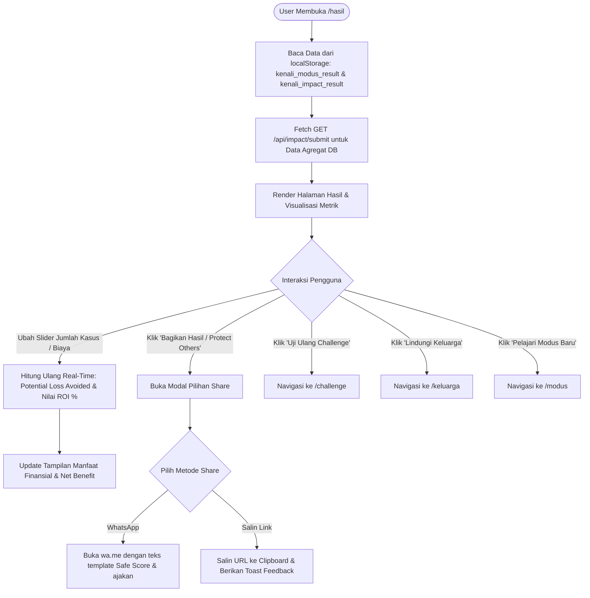

# Flow Dokumentasi: Hasil Simulasi & Kalkulator Dampak (`/hasil`)

Dokumentasi alur dan logika untuk halaman **Hasil Simulasi & Analisis Dampak Behavioral** pada aplikasi **Kenali Modus**. Halaman ini menyajikan skor personal Safe Score, analisis perbandingan Pre-Test vs Post-Test, kalkulator ROI & mitigasi potensi kerugian finansial (benchmark OJK), serta fitur ajakan viralisasi (*Protect Others*).

---

## 1. Ikhtisar Alur Halaman (Page Overview)

1. **Inisialisasi & Pengambilan Data**:
   - Membaca hasil simulasi dari `localStorage`: `kenali_modus_result` (skor umum) dan `kenali_impact_result` (data pre/post test).
   - Memanggil `GET /api/impact/submit` untuk memuat data agregat nasional dari Neon PostgreSQL (rata-rata penurunan risiko nasional, total potensi kerugian yang berhasil dicegah).
2. **Kartu Skor Safe Score**:
   - Menampilkan skor 0-100 dengan badge kualitatif (*Tinggi / Waspada*, *Cukup*, *Rentan*).
   - Menampilkan status lencana (*Badge*) yang diraih (misal: *Guardian of Security*).
3. **Komparasi Efektivitas Intervensi (Pre vs Post)**:
   - Visualisasi grafik / bar komparasi *Pre-Test Risky Rate* vs *Post-Test Risky Rate*.
   - Menampilkan persentase *Relative Risk Reduction* dan *Behavioral Impact*.
4. **Kalkulator Finansial & ROI Intervensi (Simulasi Kerugian OJK)**:
   - Menggunakan benchmark kerugian rata-rata per laporan penipuan (Rp 21.894.880,- berdasarkan data agregat OJK).
   - Slider / input dinamis:
     - **Jumlah Laporan Penipuan yang Ditekan** (misal 1.000 laporan).
     - **Biaya Implementasi Edukasi** (misal Rp 250 Juta).
   - Menghitung secara real-time:
     - **Potential Loss Avoided** (Total kerugian yang berhasil diselamatkan).
     - **Net Benefit & Return on Investment (ROI)**.
5. **Fitur "Protect Others" (Viral Loops & Social Sharing)**:
   - Modal popup untuk berbagi hasil ke WhatsApp dengan teks personalisasi.
   - Fitur salin link hasil / tantangan ke clipboard.
6. **Aksi Lanjutan**:
   - Tombol ulangi challenge (`/challenge`), lihat ensiklopedia modus (`/modus`), atau pantau skor keluarga (`/keluarga`).

---

## 2. Diagram Alur (Flowchart)

---

## 3. Parameter Kalkulator Finansial (Sesuai Bab 4.3 Analisis)

| Parameter | Nilai Default | Keterangan |
| :--- | :--- | :--- |
| `IMPACT_BENCHMARK_OJK.averageLossPerReport` | Rp 21.894.880 | Rata-rata kerugian riil per korban berdasarkan data agregat laporan OJK. |
| `scenarioReportCount` | 1.000 Laporan | Simulasi volume nasabah / laporan dalam skala institusi. |
| `implementationCost` | Rp 250.000.000 | Estimasi biaya program kampanye & pengembangan modul intervensi. |
| **Formula Potential Benefit** | $\text{Kasus} \times \left(\frac{\text{Reduction}}{100}\right) \times \text{Avg Loss}$ | Total dana nasabah yang terselamatkan dari potensi scam. |
| **Formula ROI** | $\left(\frac{\text{Benefit} - \text{Cost}}{\text{Cost}}\right) \times 100\%$ | Tingkat efisiensi ekonomi dari program pencegahan *fraud*. |

---

## 4. Input & Output

- **Input**: Data hasil simulasi pengguna, input slider parameter simulasi keuangan.
- **Output**: Visualisasi Safe Score, ringkasan efektivitas intervensi kognitif, proyeksi finansial OJK, tautan berbagi sosial.
