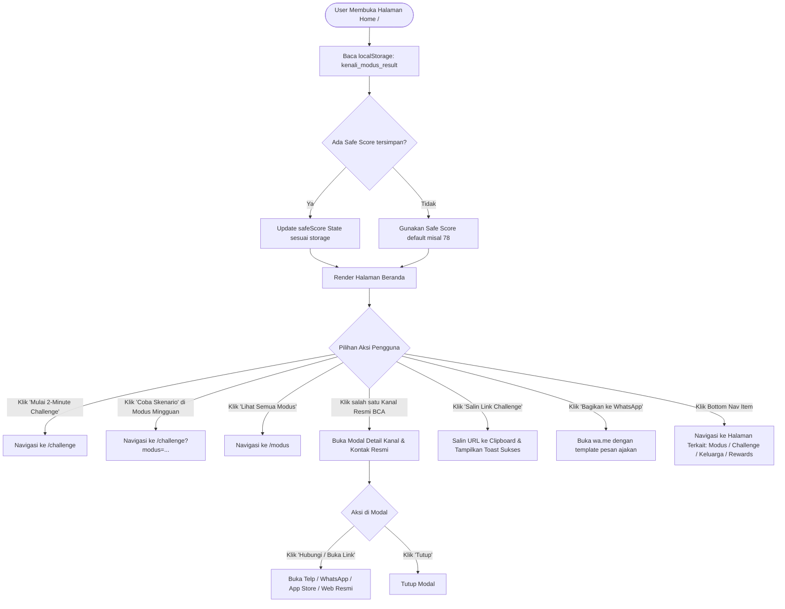

# Flow Dokumentasi: Beranda / Home (`/`)

Dokumentasi alur dan logika untuk halaman Beranda (**Home Page**) pada aplikasi **Kenali Modus**. Halaman ini berfungsi sebagai portal edukasi utama, ringkasan Safe Score pengguna, pengenalan modus mingguan (*Modus of the Week*), jalur konversi cepat (*Core Habit Loop*), dan pusat saluran pelaporan/bantuan resmi BCA.

---

## 1. Ikhtisar Alur Halaman (Page Overview)

1. **Inisialisasi & Pembacaan State**:
   - Sistem membaca `localStorage` (`kenali_modus_result`) untuk mengecek Safe Score terbaru pengguna (default 78 jika belum pernah simulasi).
   - Menyiapkan URL asal (*origin URL*) untuk fitur share / copy link.
2. **Hero Section & Quick CTA**:
   - Menampilkan value proposition utama: dari edukasi pasif menuju latihan refleks keputusan.
   - Tombol CTA utama: **Mulai 2-Minute Challenge** (`/challenge`).
3. **Core Habit Loop & Fitur Unggulan**:
   - Menjelaskan siklus intervensi (Simulasi Interaktif $\rightarrow$ Safe Score $\rightarrow$ Edukasi Mikro $\rightarrow$ Proteksi Bersama).
4. **Modus of the Week (Sorotan Mingguan)**:
   - Menampilkan card modus terhangat dengan tag bahaya, deskripsi, tips pencegahan, dan tombol untuk coba skenario terkait.
5. **Kanal Pengaduan & Layanan BCA (Modal Interaktif)**:
   - Memberikan akses cepat ke Halo BCA 1500888, WhatsApp Resmi BCA bercentang biru, aplikasi HaloBCA, dan portal Patroli Siber / CekRekening.
6. **Viral Share & Proteksi Keluarga**:
   - Fitur copy link ajakan uji Safe Score via WhatsApp atau Clipboard.
7. **Bottom Navigation**:
   - Navigasi cepat antar halaman: Beranda, Modus & Edu, Challenge, Keluarga, Rewards.

---

## 2. Diagram Alur (Flowchart)

---

## 3. Komponen & State Management

| State / Data | Tipe | Sumber | Deskripsi |
| :--- | :--- | :--- | :--- |
| `safeScore` | `Number` | `localStorage` (`kenali_modus_result`) | Skor kewaspadaan keamanan terakhir pengguna. |
| `copied` | `Boolean` | Internal React State | Menandai apakah feedback toast copy link sedang aktif. |
| `activeChannelModal` | `Object \| null` | `MODUS_LIST` / Data Lokal | Menyimpan channel aduan BCA mana yang sedang dibuka popup-nya. |
| `originUrl` | `String` | `window.location.origin` | URL base aplikasi untuk share link dinamis. |

---

## 4. Input & Output

- **Input**:
  - Interaksi klik CTA, kartu edukasi, tombol share WhatsApp/Clipboard, klik kanal resmi.
- **Output**:
  - Navigasi ke halaman simulasi challenge, ensiklopedia modus, fitur keluarga, atau link eksternal kontak resmi BCA.
