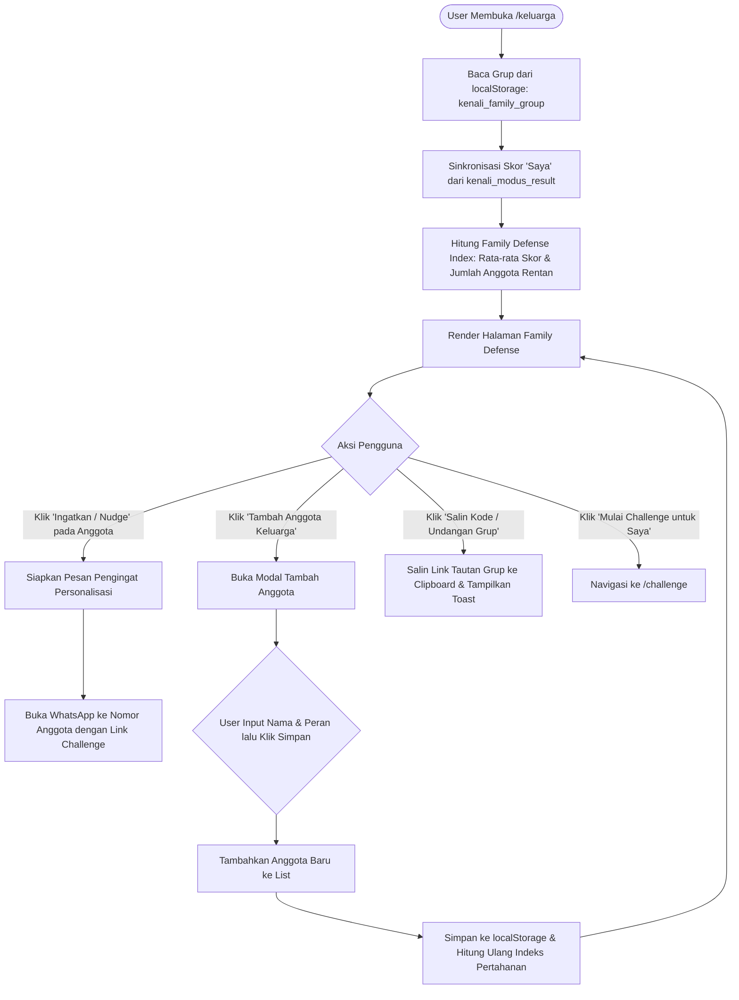

# Flow Dokumentasi: Perlindungan Keluarga / Social Defense (`/keluarga`)

Dokumentasi alur dan logika untuk halaman **Perlindungan Keluarga (Family Defense Group)** pada aplikasi **Kenali Modus**. Halaman ini mengimplementasikan konsep *Social Accountability & Collective Defense*, di mana satu anggota keluarga yang sadar keamanan dapat memantau, mengundang, dan mengingatkan anggota keluarga lainnya yang rentan terhadap kejahatan perbankan digital.

---

## 1. Ikhtisar Alur Halaman (Page Overview)

1. **Inisialisasi & Sinkronisasi Grup**:
   - Membaca grup keluarga dari `localStorage` (`kenali_family_group`), atau memuat daftar bawaan (`DEFAULT_FAMILY_MEMBERS`).
   - Sinkronisasi skor profil "Saya" dengan hasil simulasi terakhir dari `localStorage` (`kenali_modus_result`).
2. **Kalkulasi Family Defense Index (Indeks Pertahanan Keluarga)**:
   - Menghitung rata-rata Safe Score seluruh anggota keluarga.
   - Mengidentifikasi jumlah anggota yang berada dalam kategori rentan (Skor $< 65$).
   - Menentukan status agregat keluarga: *Tinggi (Terlindungi)*, *Waspada Sedang*, atau *Rentan (Perlu Perhatian Segera)*.
3. **Manajemen Anggota Keluarga**:
   - Menampilkan daftar kartu anggota keluarga beserta peran (Ayah, Ibu, Kakek, Adik, dll.), skor personal, dan status kewaspadaan.
   - **Fitur Tambah Anggota**: Modal popup untuk menambahkan anggota baru (Nama, Hubungan/Peran, skor awal).
4. **Fitur "Nudge" / Ingatkan Anggota Rentan**:
   - Tombol pengingat cepat (*Nudge*) pada anggota dengan status rentan.
   - Mengirimkan pesan WhatsApp otomatis yang berisi ajakan ramah untuk berlatih di simulasi 2-Minute Challenge.
5. **Fitur Undangan Grup (Social Viral Loop)**:
   - Kode undangan grup unik (misal `AMAN-BCA-778`).
   - Fitur salin link dan bagikan tautan grup keluarga via WhatsApp.
6. **Edukasi Khusus Perlindungan Lansia & Anak Muda**:
   - Panduan praktis bagi *Family Admin* mengenai cara membimbing orang tua agar tidak mudah percaya telepon mengatasnamakan bank.

---

## 2. Diagram Alur (Flowchart)

---

## 3. Komponen & State Management

| State / Data | Tipe | Deskripsi |
| :--- | :--- | :--- |
| `members` | `Array<Object>` | Daftar anggota keluarga `{ id, name, role, score, status, isSelf, avatar }`. |
| `groupName` | `String` | Nama grup keluarga (misal: "Keluarga Sejahtera"). |
| `inviteCode` | `String` | Kode unik untuk bergabung ke grup keluarga. |
| `showAddModal` | `Boolean` | Flag visibilitas modal penambahan anggota. |
| `newMemberName` | `String` | Input form nama anggota baru. |
| `newMemberRole` | `String` | Input form peran (Ayah, Ibu, Nenek, dll.). |
| `avgScore` | `Number` | Rata-rata Safe Score seluruh anggota keluarga. |
| `vulnerableCount` | `Number` | Jumlah anggota dengan skor di bawah 65. |

---

## 4. Format Pesan "Nudge" WhatsApp

$$\text{Template Pesan:} \text{"Halo [Nama], yuk luangkan 2 menit untuk uji kewaspadaan terhadap penipuan online di KENALI MODUS agar keluarga kita makin aman: [URL_CHALLENGE]"}$$
