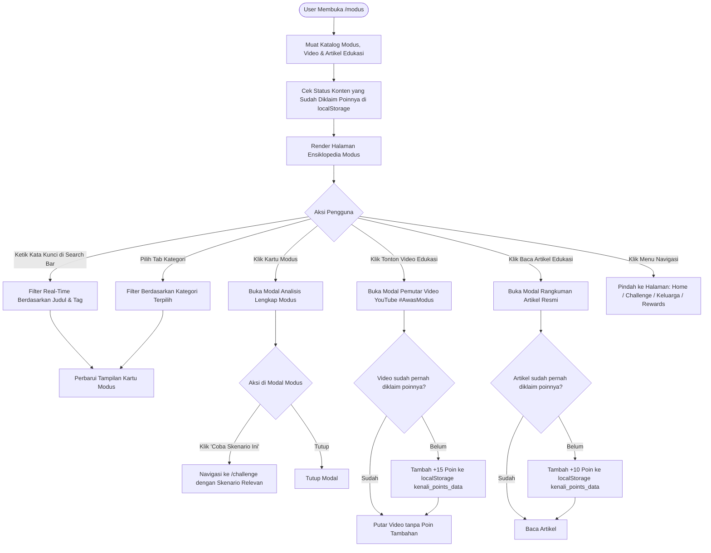

# Flow Dokumentasi: Modus & Edukasi Ensiklopedia (`/modus`)

Dokumentasi alur dan logika untuk halaman **Ensiklopedia Modus & Edukasi Resmi #AwasModus** pada aplikasi **Kenali Modus**. Halaman ini berfungsi sebagai pusat literasi keamanan perbankan, katalog jenis penipuan digital (*Social Engineering*, *Phishing*, *Malware/APK*, dll.), media pembelajaran multimedia (Video & Artikel resmi BCA), serta sistem insentif poin literasi.

---

## 1. Ikhtisar Alur Halaman (Page Overview)

1. **Inisialisasi & Load Data**:
   - Membaca `MODUS_LIST`, `BCA_EDU_VIDEOS`, `BCA_EDU_ARTICLES`, dan `PIPELINE_STEPS` dari data referensi.
   - Mengambil status media yang sudah diklaim poinnya dari `localStorage` (`kenali_points_data`).
2. **Pencarian & Filter Multi-Kategori**:
   - Filter berdasarkan tab kategori: *Semua*, *Phishing*, *Social Engineering*, *Malware / APK*, *SIM Swap*, dll.
   - Pencarian teks instan berdasarkan judul, deskripsi, atau kata kunci bahaya.
3. **Anatomi Modus & Siklus Kejahatan (Pipeline 4 Langkah)**:
   - Visualisasi bagaimana pelaku bekerja: *Kontak Awal $\rightarrow$ Manipulasi Emosi $\rightarrow$ Permintaan Data Sensitif $\rightarrow$ Pengurasan Rekening*.
4. **Modal Interaktif Detail Modus**:
   - Membuka popup analisis mendalam: studi kasus, tanda-tanda bahaya (*red flags*), tindakan pencegahan, dan tombol langsung uji skenario challenge terkait.
5. **Pusat Edukasi Video & Artikel (Gamifikasi Belajar & Rewards)**:
   - Pengguna menonton video edukasi resmi BCA (embed YouTube player).
   - Pengguna membaca rangkuman artikel edukasi resmi.
   - **Mekanisme Reward Poin**: Menonton video (+15 Poin) atau membaca artikel (+10 Poin) secara otomatis menambahkan poin reward ke akun pengguna (hanya bisa diklaim 1x per konten).
6. **Integrasi Saluran Bantuan Cepat**:
   - Akses langsung ke kontak darurat Halo BCA 1500888 jika pengguna merasa sedang menjadi target modus yang sedang dibaca.

---

## 2. Diagram Alur (Flowchart)

---

## 3. Komponen & State Management

| State / Variabel | Tipe | Deskripsi |
| :--- | :--- | :--- |
| `selectedCategory` | `String` | Kategori filter aktif (Default: `'Semua'`). |
| `searchQuery` | `String` | Input pencarian kata kunci oleh pengguna. |
| `activeModusModal` | `Object \| null` | Data modus yang sedang terbuka di popup modal. |
| `activeVideoModal` | `Object \| null` | Data video aktif yang sedang diputar di modal. |
| `activeArticleModal` | `Object \| null` | Data artikel aktif yang sedang dibaca di modal. |
| `claimedMedia` | `Array<String>` | Daftar ID konten video/artikel yang poinnya telah diklaim. |

---

## 4. Input & Output

- **Input**: Query pencarian, filter kategori, klik kartu modus, interaksi tonton video atau baca artikel.
- **Output**: Modal detail komprehensif, pemutar video, penambahan reward points ke profil pengguna.
