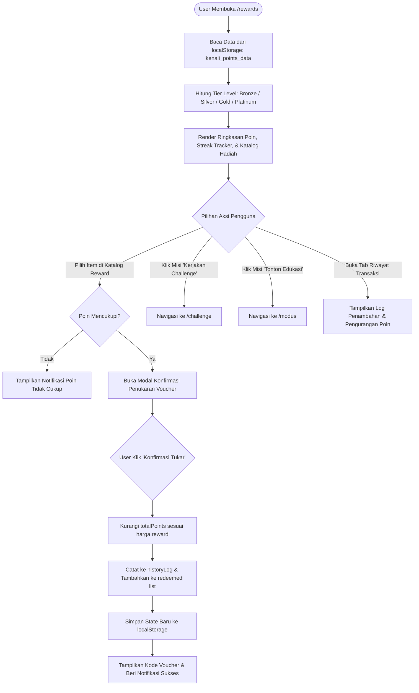

# Flow Dokumentasi: Rewards & Poin Insentif (`/rewards`)

Dokumentasi alur dan logika untuk halaman **Rewards, Poin Insentif & Gamifikasi Literasi** pada aplikasi **Kenali Modus**. Halaman ini mengelola sistem insentif (*Streak*, *Tier Status*, *Reward Catalog*, *Penukaran Voucher/Merchandise BCA*, dan *Leaderboard* komunitas).

---

## 1. Ikhtisar Alur Halaman (Page Overview)

1. **Inisialisasi & Pengambilan Data Poin**:
   - Membaca saldo poin, streak harian, daftar voucher yang sudah ditukar, dan log histori transaksi poin dari `localStorage` (`kenali_points_data`).
   - Membaca Safe Score pengguna dari `localStorage` (`kenali_modus_result`).
2. **Kalkulasi Tier Status Pengguna**:
   - Menentukan tingkatan lencana berdasarkan total poin:
     - **Bronze Guardian** (0 - 99 Poin)
     - **Silver Protector** (100 - 249 Poin)
     - **Gold Champion** (250 - 499 Poin)
     - **Platinum Legend** (500+ Poin)
   - Menghitung sisa poin yang dibutuhkan untuk naik ke Tier berikutnya.
3. **Daily Streak Tracker (Kebiasaan Literasi Mingguan)**:
   - Visualisasi tracker 7 hari (Senin s/d Minggu) yang menandai keaktifan pengguna menjaga *streak* latihan kewaspadaan.
4. **Katalog Penukaran Reward (Reward Redemption)**:
   - Menampilkan berbagai hadiah: *Voucher Belanja*, *Diskon Transaksi QRIS/m-BCA*, *Merchandise Eksklusif #AwasModus*, dan *E-Wallet Topup*.
   - Validasi saldo poin: Jika poin cukup $\rightarrow$ tombol aktif; jika kurang $\rightarrow$ tombol disabled.
   - **Modal Konfirmasi Penukaran**: Pengguna meninjau rincian penukaran $\rightarrow$ potong saldo poin $\rightarrow$ simpan voucher ke tab *Sudah Ditukar* $\rightarrow$ catat ke riwayat.
5. **Daftar Aktivitas Perolehan Poin (Earn Points Guide)**:
   - Menjelaskan cara menambah poin:
     - Selesaikan 2-Minute Challenge (+10 Pts)
     - Sempurna 100% Benar (+10 Pts Bonus)
     - Tonton Video Edukasi BCA (+15 Pts)
     - Baca Artikel Edukasi (+10 Pts)
     - Bagikan Challenge ke Teman/Keluarga (+10 Pts)
6. **Leaderboard Komunitas**:
   - Menampilkan peringkat *Top Anti-Fraud Champions* untuk menciptakan kompetisi positif antar nasabah.

---

## 2. Diagram Alur (Flowchart)

---

## 3. Komponen & State Management

| State / Variabel | Tipe | Deskripsi |
| :--- | :--- | :--- |
| `totalPoints` | `Number` | Total poin reward aktif yang dimiliki pengguna. |
| `streakCount` | `Number` | Jumlah hari berturut-turut pengguna aktif berlatih. |
| `redeemed` | `Array<String>` | Daftar ID hadiah yang telah berhasil ditukarkan. |
| `historyLog` | `Array<Object>` | Riwayat mutasi poin `{ id, activity, points, date }`. |
| `redeemModal` | `Object \| null` | Data hadiah yang sedang aktif di modal penukaran. |

---

## 4. Input & Output

- **Input**: Klik penukaran reward pada katalog, aksi konfirmasi modal redeem, navigasi misi harian.
- **Output**: Pengurangan saldo poin, penerbitan voucher digital, pembaruan status tier dan streak level.
